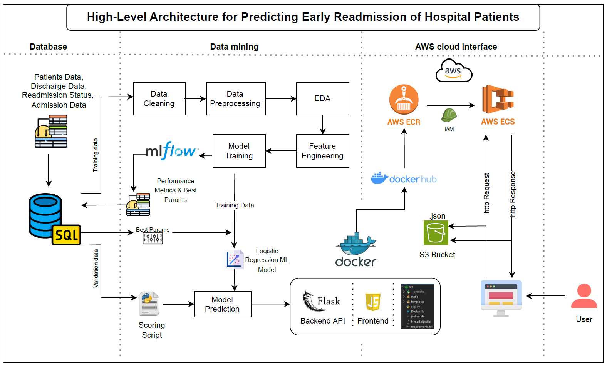

# Early Readmission Prediction for Hospital Patients

## Project Description

The goal of this project is to develop a machine learning model that predicts the likelihood of early readmission for hospital patients. The model will be trained using a dataset containing patient demographics, medical history, and hospital outcomes. The primary focus will be on improving the accuracy and interpretability of the model, as well as ensuring that it is fair and unbiased.

Data Source: https://archive.ics.uci.edu/dataset/296/diabetes+130-us+hospitals+for+years+1999-2008

Research Reference: https://onlinelibrary.wiley.com/doi/10.1155/2014/781670
Impact of HbA1c Measurement on Hospital Readmission Rates: Analysis of 100k Clinical Database Patient Record By Beata Strack, Jonathan DeShazo, Chris Gennings, Juan Olmo, Sebastian Ventura, Krzysztof Cios, John Clore.


## Project Objectives

1. Develop a machine learning model that accurately predicts early readmission for hospital patients.
2. Implement feature engineering techniques to improve the model's performance and interpretability.
3. Evaluate the model's fairness and unbiasedness, ensuring that it does not discriminate against certain patient groups.
4. Develop a user-friendly web application that allows users to input patient information and receive predictions from the model.
5. Document the project's progress, challenges, and lessons learned throughout the development process.


## Technologies Used
1. Programming languages: Python, SQL, HTML, CSS, Javascript
2. Machine Learning: Logistic Regression, Random Forest Classifier, Gradient Boost Classifier
3. Frontend: Javascript (for frontend Web UI)
4. Backend: Flask (for API services)
5. Containerization: Docker
6. Cloud: AWS ECS, AWS S3
7. Model Tracking: MLflow
8. Version Control: Github

## Architecture



**User Input:** User interacts with the Frontend web UI before discharging patient from the hospital.

**Backend API:** Flask(uvicorn server) processes the input, triggering the fraud prediction model.

**ML Model:** Logistic Regression model, loaded via MLflow, predicts if the patient going to readmit in the hospital.

**Storage:** All processed data and predicted data is stored in AWS S3.

**Deployment:** The application is dockerized and deployed on AWS ECS.

## Installation

To run the project locally, follow these steps:

1. Clone the repository:

```bash
git clone https://github.com/rohit180497/Early-readmission-of-patients-in-hospital.git
cd Early-readmission-of-patients-in-hospital/src
```

2. Build and run the Docker container:

```bash
docker build -t Early-readmission-of-patients-in-hospital .
docker run -p 8000:8000 Early-readmission-of-patients-in-hospital
```

3. Install dependencies (if not using Docker):

```bash
pip install -r requirements.txt
```

4. Run Flask Application:

```bash
python app.py --host 0.0.0.0 --port 8000  
```

## Usage

Access the Flask Application for predictions at: http://localhost:8000

Submit patient data through the web interface to get predictions on whether a patient will readmit in the hospital.

## Deployment
This project is deployed using AWS Elastic Container Service (ECS) with Docker. The following services are used in the deployment process:

**AWS ECS**: For managing the Docker container cluster.

**AWS S3**: For storing the input/output data.

**AWS ECR**: For storing the Docker images.

## Steps for deployment:

1. Push the Docker image to AWS ECR.

2. Create an ECS cluster and task definition to run the Docker container.

3. Expose port 8000 to make the service publicly accessible.

## Model Performance

- Model: Logistic Regression

- Threshold: 0.45

- Metric: Precision (77%)

- Capture Rate: 63% in the top 4 percentile.

